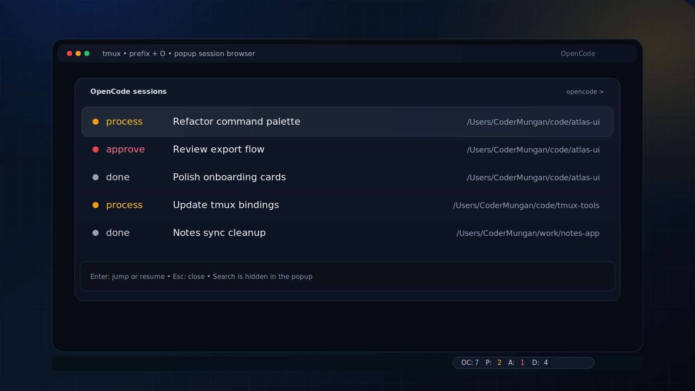

# tmux-opencode

[](https://github.com/CoderMungan/tmux-opencode/releases)

<p align="center">
  
</p>

A bash-only tmux plugin for browsing, tracking, and resuming [opencode](https://opencode.ai/) sessions.

If you also want durable context across coding sessions, check out [ctx](https://github.com/ActiveMemory/ctx):

- a lightweight, file-based context system for AI coding assistants
- useful for keeping tasks, decisions, and learnings persistent across terminal sessions

## Community

- Join our community: [kampus](https://discord.gg/kampus)
- ctx community: [Discord](https://discord.gg/kQNZFemKuZ)

It combines two sources of truth:

- live tmux panes currently running `opencode`
- the local opencode SQLite session database

That gives you one session browser for:

- attached sessions already open in tmux
- sessions with active work in progress
- sessions waiting for user approval/input
- completed sessions

## Features

- TPM-compatible plugin entrypoint
- popup session browser
- jump to an already attached tmux pane
- resume any stored session in a new tmux window or split pane
- status segment for `status-left` or `status-right`
- `fzf` support when available
- shell-only implementation with no `jq` dependency
- collapses opencode orchestrator/subagent trees under the root session

## Requirements

- tmux `>= 3.2` (`display-popup` is required)
- bash
- `sqlite3`
- `opencode` CLI available in `PATH`
- optional: `fzf` for fuzzy popup search

## Install with TPM

Add this to your `~/.tmux.conf`:

```tmux
set -g @plugin 'CoderMungan/tmux-opencode'
run '~/.tmux/plugins/tpm/tpm'
```

Install with `prefix + I`.

## Manual install

```tmux
source-file '/absolute/path/to/tmux-opencode/opencode.tmux'
```

## Status line integration

The plugin does not overwrite your existing status line automatically.

Add the segment wherever you want:

```tmux
set -g status-right '#(/absolute/path/to/tmux-opencode/scripts/opencode-status.sh) | %H:%M'
```

Example output:

```text
OC:12 P:3 A:1 D:8
```

Where:

- `OC` = total sessions shown
- `P` = processing / active work
- `A` = waiting for approval or human input
- `D` = done

## Default key binding

- `prefix + O` opens the popup browser

Change it with:

```tmux
set -g @opencode-key 'o'
```

## Configuration

```tmux
set -g @opencode-key 'O'
set -g @opencode-status-position 'right'
set -g @opencode-popup-width '90%'
set -g @opencode-popup-height '80%'
set -g @opencode-stale-minutes '240'
set -g @opencode-show-archived 'false'
set -g @opencode-max-sessions '50'
set -g @opencode-db-path "$HOME/.local/share/opencode/opencode.db"
set -g @opencode-resume-target 'window'
set -g @opencode-status-colors 'true'
```

### Options

| Option | Default | Description |
| --- | --- | --- |
| `@opencode-key` | `O` | Prefix binding that opens the popup |
| `@opencode-status-position` | `right` | Documentation-only hint for where you place the status segment |
| `@opencode-popup-width` | `90%` | Popup width |
| `@opencode-popup-height` | `80%` | Popup height |
| `@opencode-stale-minutes` | `240` | Sessions older than this become `stale` |
| `@opencode-show-archived` | `false` | Include archived sessions |
| `@opencode-max-sessions` | `50` | Max sessions pulled from the database |
| `@opencode-db-path` | `~/.local/share/opencode/opencode.db` | Path to the local opencode database |
| `@opencode-resume-target` | `window` | Resume into `window` or `pane` |
| `@opencode-status-colors` | `true` | Enable tmux color escapes in the status segment |

## Popup workflow

When you open the popup:

- if `fzf` is installed, you get fuzzy search
- otherwise, you get a numbered fallback menu
- each row shows a colored dot, normalized status, session title, and project directory
- the internal `ses_...` session id is kept for resume/jump behavior but hidden from the UI

Popup status colors:

- yellow `process` = work is still running
- red `approve` = waiting for approval or user input
- gray `done` = no active work detected

For orchestrator/multiagent workflows, child/subagent sessions are folded into their root parent session using `session.parent_id`:

- child sessions do not appear as separate top-level rows
- the visible row represents the root/orchestrator session
- attached tmux panes for child sessions are mapped back onto the parent row when possible
- selecting the row always resumes/jumps with the parent session id

Selecting a session does one of two things:

1. if that session is already attached to a tmux pane, the plugin jumps to that pane
2. otherwise, it runs `opencode --session <session-id>` in a new tmux window or split pane

## Session detection

### tmux side

The plugin scans tmux panes using:

- `#{pane_current_command}`
- `#{pane_pid}`
- `ps -p <pid> -o command=`
- `#{pane_current_path}`
- `#{pane_title}`

### opencode side

The plugin reads the local SQLite database directly, usually from:

```text
~/.local/share/opencode/opencode.db
```

It reads the `session` table and uses fields like:

- `id`
- `title`
- `directory`
- `path`
- `time_updated`
- `time_created`
- `time_archived`
- `agent`
- `model`
- `parent_id`

It also inspects recent `message` and `part` records to distinguish active processing from approval/user-input waits.

### Merge strategy

Live tmux panes are matched to database sessions by working directory on a best-effort basis. If no database match is found, the pane still appears as a `tmux-only` attached entry.

When a tmux pane contains an opencode child session id in its process command, the plugin maps that attached state back to the parent/root row when the database knows the parent relation.

## Status meanings

- `process`: currently running work, including live tmux-attached sessions and active tool execution
- `approve`: waiting for approval or direct user input
- `done`: no active work detected

## CLI helpers

- `scripts/opencode-status.sh`
- `scripts/opencode-list.sh`
- `scripts/opencode-popup.sh`
- `scripts/opencode-resume.sh`

The list script prints tab-separated records with normalized fields:

```text
source  session_id  title  directory  path  status  updated_epoch  age_minutes  attached  pane_id  window_id  tmux_session_id  agent  model  archived  parent_id  created_epoch  child_count  child_status_summary  root_session_id
```

## Validation

```bash
make validate
```

## Limitations

- matching live tmux panes to stored sessions is best-effort
- opencode database schema changes may require plugin updates
- runtime status is inferred from local SQLite records, not from a formal opencode runtime API

## Privacy

This plugin reads local tmux metadata and local opencode session metadata only.

It does not send data anywhere.

## License

MIT
